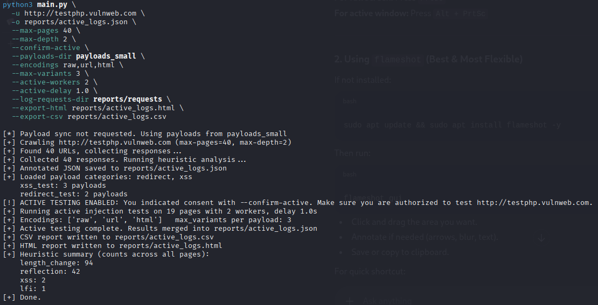
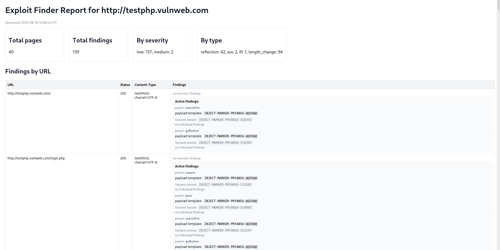
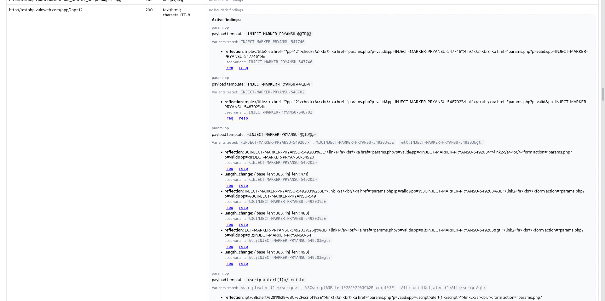
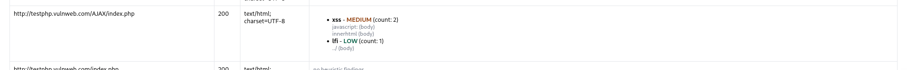
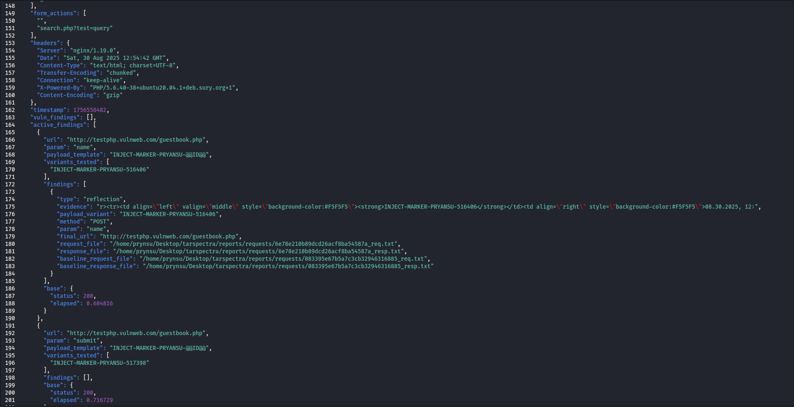
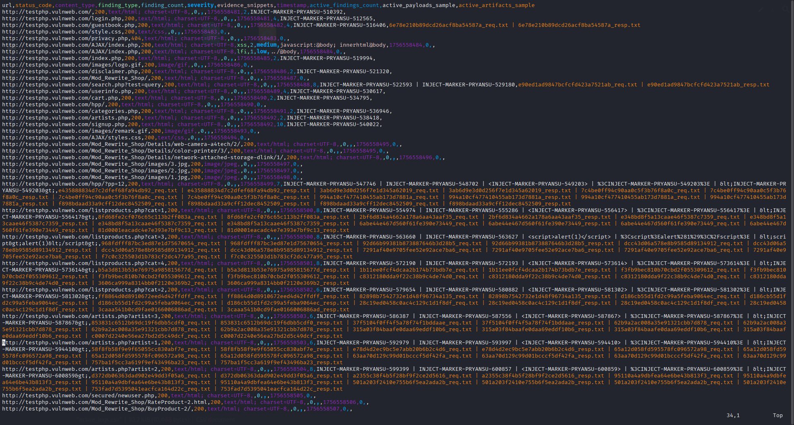

# 🚀 TARSPECTRA Active Vuln Scanner
Because **why not reinvent the wheel but with spikes**?  
This tool is your friendly neighborhood **website vulnerability sniffer** with some **serious attitude**.
```
                    ░▀█▀░█▀█░█▀▄░█▀▀░█▀█░█▀▀░█▀▀░▀█▀░█▀▄░█▀█
                    ░░█░░█▀█░█▀▄░▀▀█░█▀▀░█▀▀░█░░░░█░░█▀▄░█▀█
                    ░░▀░░▀░▀░▀░▀░▀▀▀░▀░░░▀▀▀░▀▀▀░░▀░░▀░▀░▀░▀
```
---

## ⚡ What is this?
A Python-based **active vulnerability scanner** that:
- Crawls a target website like a hungry bot
- Detects **potentially insecure spots** using heuristic checks
- Actively tests vulnerabilities using **real payloads from the internet**
- Generates **HTML reports so shiny** you can flex on your LinkedIn
- Supports **multi-threaded active testing** (because single-thread is for quitters)

---

## 🛠 Features:
✅ Smart crawling (URLs, forms, and more)  
✅ Heuristic-based detection (**a.k.a. guessing with style**)  
✅ Active vulnerability testing using **live payloads**  
✅ Generates **sexy HTML reports** with details  
✅ CLI usage that makes you feel like a hacker in a movie  
✅ Multi-threaded scanning for **speed demons**  

---

## ⚠️ Disclaimer (Read this or get sued)
- Don’t point this at **websites you don’t own** (unless you like prison food)  
- This tool is for **educational & research purposes only**  
- If you **DDoS your college website**, don’t DM me crying  
- Seriously, **USE RESPONSIBLY**  

---

## 🧩 Installation (Linux only, because Windows users… you know why)
```bash
# 1. Clone this masterpiece
git clone https://github.com/yourusername/pryansec-active-scanner.git
cd pryansec-active-scanner

# 2. Install dependencies
sudo apt update && sudo apt install python3 python3-pip -y
pip3 install -r requirements.txt

# 3. Make a payload directory (because chaos needs structure)
mkdir payloads
echo "<script>alert(1)</script>" > payloads/xss.txt
echo "' OR 1=1 --" > payloads/sql.txt
```
---

## ▶️ Usage
```
python3 main.py -u http://testphp.vulnweb.com \
-o reports/active.json \
--max-pages 40 \
--max-depth 2 \
--confirm-active \
--active-workers 2 \
--active-delay 0.8 \
--payloads-dir payloads
```
---

## 🖼️ Screenshot Showcase

Because nobody reads text without pictures:

<p float="left">
  
  
  
  
  
  
</p>

---

## ✅ Example Output:
```
URL: http://testphp.vulnweb.com/userinfo.php
Payload used: ' OR 1=1 --
Type: SQL Injection
Status: Vulnerable ✅
```

---

## 🎯 Roadmap:

☑️Crawling & heuristics
☑️Active scanning with payloads
☑️HTML reports that blind your enemies
🔜Real-time payload fetching from PayloadAllTheThings
🔜AI-based vulnerability scoring (because why not?)

---

## ⭐ Pro Tip:

If you run this on Google.com, don’t blame me when FBI shows up.

---

## 🤘 Contribute:

Pull requests are welcome, but only if your code doesn’t look like a horror movie.

---

# Made with ❤️, ☕, and zero legal liability.
